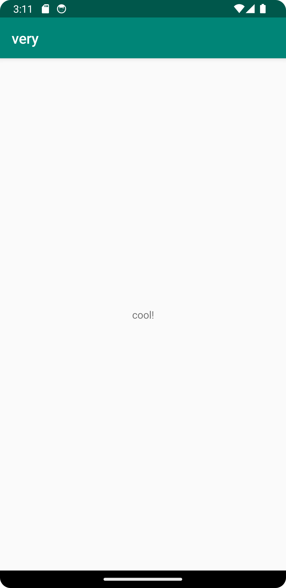

# Report

1. Edited center text to "cool!"

2. Edited app name to "very"


## Code

1.
```
<TextView
android:layout_width="wrap_content"
android:layout_height="wrap_content"
android:text="cool!"                             <---------
app:layout_constraintBottom_toBottomOf="parent"
app:layout_constraintEnd_toEndOf="parent"
app:layout_constraintStart_toStartOf="parent"
app:layout_constraintTop_toBottomOf="@+id/appBarLayout" />

```
2.
```
<resources>
    <string name="app_name">very</string>
</resources>
```



